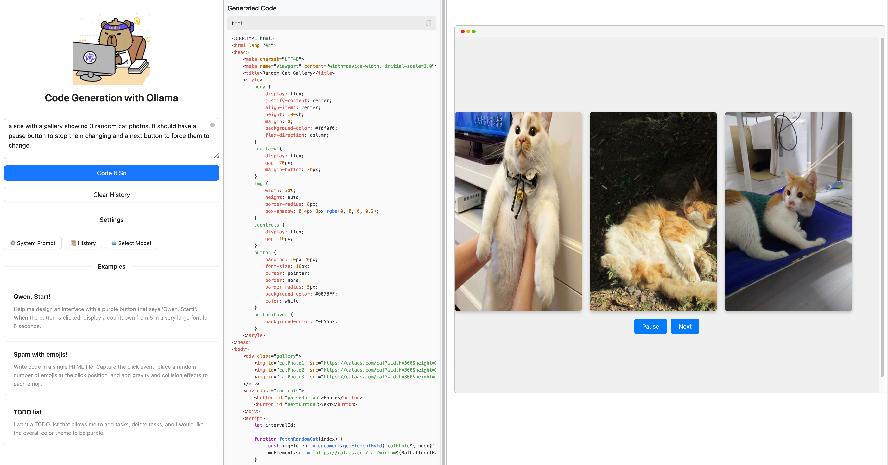

# Ollama Code Artefacts

## Running the code

```bash
uv venv
source .venv/bin/activate
uv pip install -U -r requirements.txt
python app.py
```

## Screenshot



---

Originally forked from https://huggingface.co/spaces/Qwen/Qwen2.5-Coder-Artifacts
